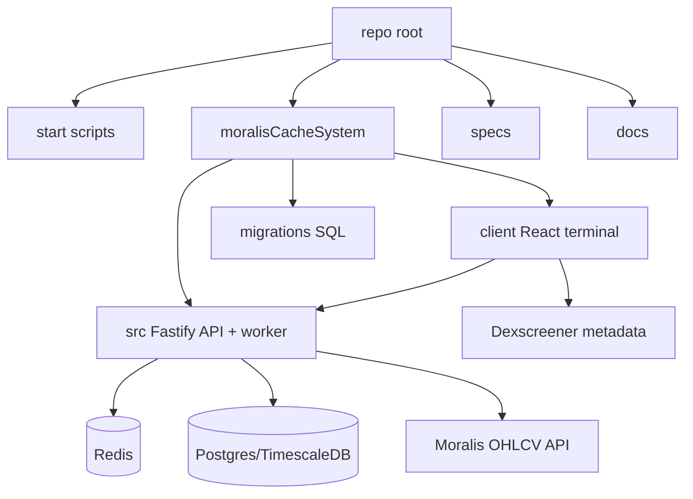

# moralisCharting Repo Index

This vault maps the **Moralis Caching Lightweight** repo: a cache-first OHLCV charting prototype that reduces direct Moralis API usage by serving charts from Redis/Postgres and only calling Moralis for missing ranges.

## Start here

- [[01-Architecture]] — system shape, processes, and major dependencies.
- [[02-Runtime-Flow]] — request/worker startup and end-to-end chart flow.
- [[03-API-Surface]] — HTTP routes, auth, headers, and response shapes.
- [[04-Data-Model]] — database tables, Redis keys, cache behavior.
- [[05-Backend-Map]] — backend module-by-module map.
- [[06-Frontend-Map]] — React test terminal map.
- [[07-External-Services]] — Moralis, Dexscreener, Postgres, Redis, Cloudflare/GitHub Pages.
- [[08-Operations-Testing]] — scripts, env, logs, tests, deployments.
- [[09-Risks-Questions]] — important unknowns and refactor targets.
- [[10-File-Catalogue]] — concise inventory of important files.
- [[11-Module-Dependency-Graph]] — generated internal import graph.

## Codebase zones



## Main mental model

The repo exists to ensure the frontend calls **this service**, not Moralis directly:

```text
Frontend -> /api/charts/ohlcv -> Redis response cache -> Postgres candles -> Moralis only for gaps -> BullMQ backfill for large gaps
```

Key implementation notes:

- Primary backend entrypoint: `moralisCacheSystem/src/index.ts`.
- No-Docker/in-memory local entrypoint: `moralisCacheSystem/src/localIndex.ts`.
- Worker entrypoint: `moralisCacheSystem/src/worker.ts`.
- Server composition: `moralisCacheSystem/src/server.ts`.
- Core business logic: `moralisCacheSystem/src/services/chartService.ts`.
- Frontend app: `moralisCacheSystem/client/src/App.tsx`.

## Tags to use in Obsidian

- `#backend`, `#frontend`, `#api`, `#database`, `#redis`, `#worker`, `#moralis`, `#testing`, `#ops`, `#risk`

