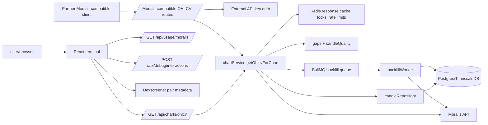

# Architecture

Related: [[00-Repo-Index]], [[02-Runtime-Flow]], [[04-Data-Model]], [[07-External-Services]]

## Purpose

A cache-first OHLCV service and test trading terminal. The system minimizes Moralis cost/overage by storing fetched candles and refusing to repeatedly fetch full chart history synchronously.

## Processes

| Process | Entrypoint | Purpose |
|---|---|---|
| API server | `moralisCacheSystem/src/index.ts` | Fastify API backed by Redis/Postgres. |
| Local API | `moralisCacheSystem/src/localIndex.ts` | No-Docker local in-memory equivalent for UI testing. |
| Worker | `moralisCacheSystem/src/worker.ts` | BullMQ worker that processes backfill jobs. |
| Frontend | `moralisCacheSystem/client/src/main.tsx` | Vite/React chart terminal. |

## Component diagram

## Core design decisions

- **Cache-first:** Redis full-response cache and Postgres candle store are checked before Moralis.
- **Gap-based provider calls:** missing/suspicious candle ranges are found and fetched selectively.
- **Concurrency control:** Redis locks dedupe concurrent gap fetches.
- **Cost controls:** request limits, provider miss limits, daily CU budgets, max synchronous pages, max synchronous gap candle count.
- **Async backfills:** large gaps and full-history loads are queued through BullMQ.
- **Moralis compatibility:** external clients can use Moralis-style paths with `X-API-Key` while the backend transparently serves cached data.

## Storage layers

- Redis: hot response cache, feature flag, rate-limit counters, locks, BullMQ queue.
- Postgres/TimescaleDB: canonical candle history, pair tracking, job state, API key metadata, provider usage, market-history state.
- Files: Pino logs and per-interaction traces under `logs/`.

