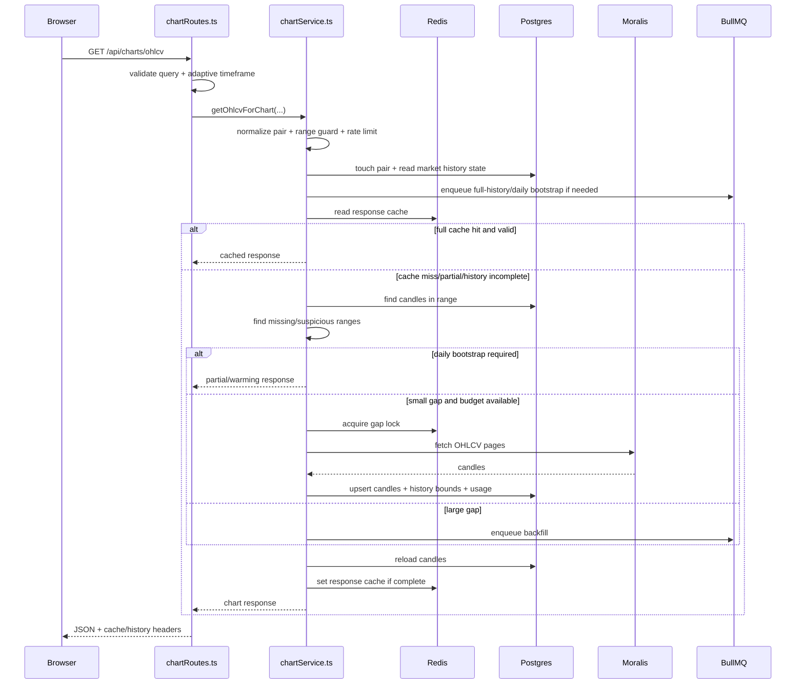
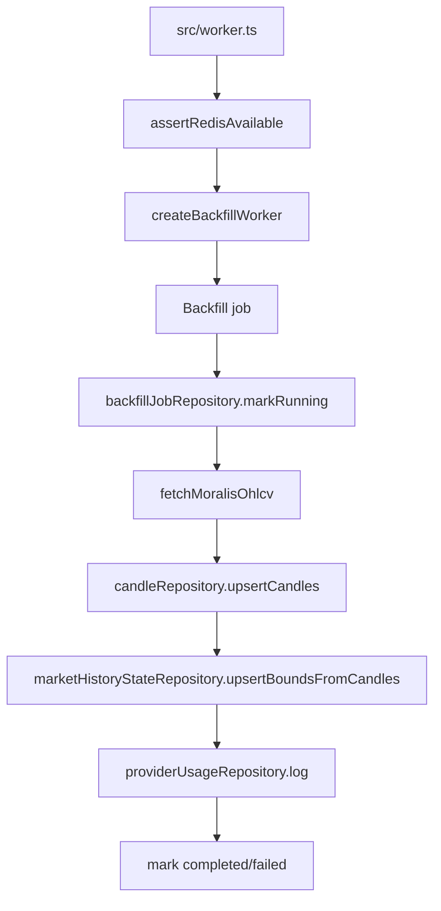

# Runtime Flow

Related: [[01-Architecture]], [[03-API-Surface]], [[05-Backend-Map]], [[06-Frontend-Map]]

## Startup flows

### Docker-backed development

```text
start.* -> npm --prefix moralisCacheSystem run dev:docker
  -> scripts/start-infra.ps1
  -> docker compose up postgres redis
  -> npm run migrate
  -> concurrently API + worker + frontend
```

### Local memory mode

```text
npm run dev or npm run dev:local
  -> src/localIndex.ts API on :3001
  -> Vite frontend on :5173
```

Local mode does not require Redis/Postgres. It is for UI/testing, not production.

## Main chart request flow



## Full-history warmup behavior

- History floor is hardcoded to `2024-01-01T00:00:00.000Z` in `chartService.ts`.
- A non-daily request requires daily (`1d`) bootstrap first.
- Full-history requests enqueue high-priority `initial_history_load` jobs.
- While history is queued/running, responses can indicate:
  - `historyWarming: true`
  - `historyProgressPct`
  - `partial: true`
  - `source: partial`

## Worker flow



## Frontend runtime behavior

- `App.tsx` tracks chain, pair, timeframe, chart range, visible range, response, usage, and int
