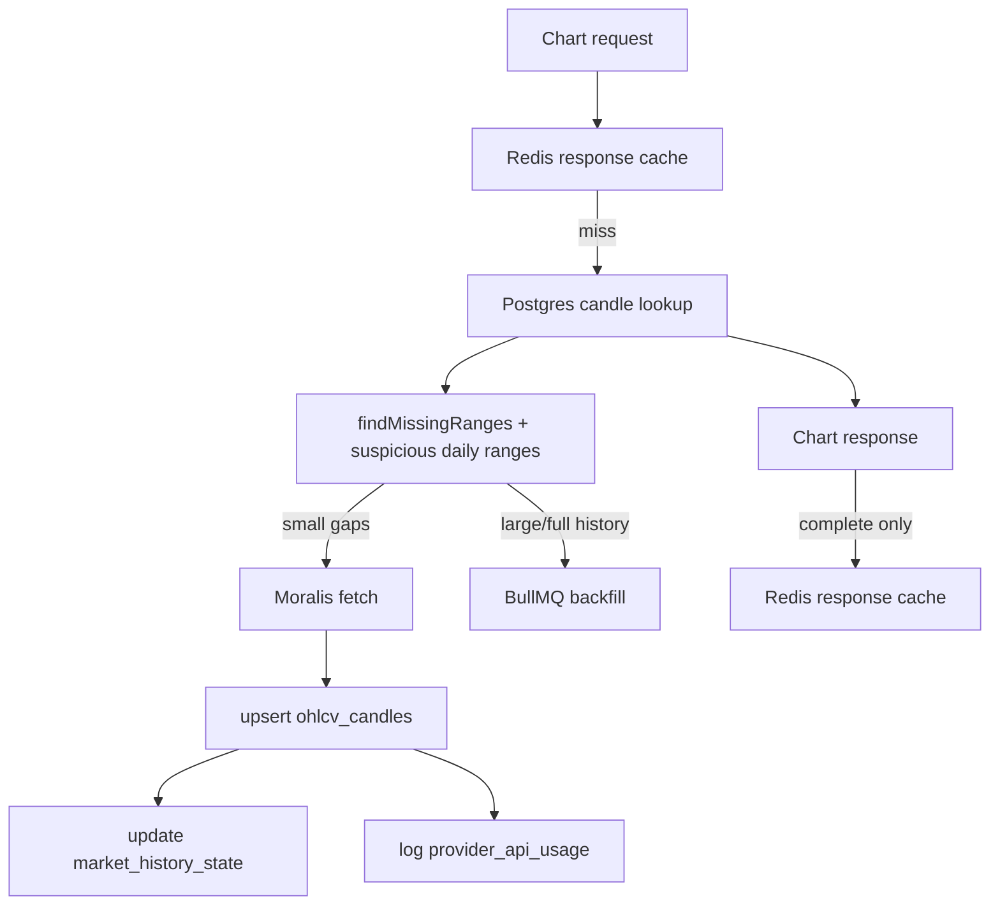

# Data Model

Related: [[01-Architecture]], [[03-API-Surface]], [[05-Backend-Map]]

## Postgres tables

Defined in `moralisCacheSystem/migrations`.

| Table | Purpose |
|---|---|
| `ohlcv_candles` | Canonical candle store keyed by chain/pair/timeframe/currency/timestamp. |
| `chart_pairs` | Tracks active/hot pairs, last requested/refreshed, request count. |
| `ohlcv_backfill_jobs` | Persistent metadata for BullMQ backfill jobs. |
| `provider_api_usage` | Moralis/API usage and estimated CU accounting. |
| `external_api_keys` | Partner API keys for Moralis-compatible routes. |
| `market_history_state` | Full-history warmup/progress/completion state. |

## Redis usage

| Use | Module | Notes |
|---|---|---|
| Response cache | `cache.ts` | Key includes chain/pair/timeframe/currency/from/to. TTL varies by timeframe. |
| Gap locks | `locks.ts` | Prevents duplicate concurrent provider fetches. |
| Rate limits | `rateLimit.ts` | Chart, provider miss, external key request/miss limits. |
| Moralis flag | `moralis.ts`, `adminRoutes.ts` | `feature:moralis_ohlcv_enabled`. |
| BullMQ | `jobs/queue.ts`, `jobs/backfillWorker.ts` | Backfill queue uses Redis connection. |

## Candle data flow

## Synthetic candle behavior

`chartService.ts` fills missing chart intervals after the latest real candle with zero-volume candles marked `source: filled`. `ChartPanel.tsx` filters filled candles out of the visible candlestick/volume series.
