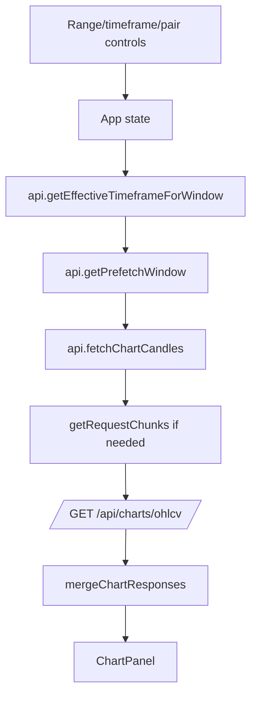

# Frontend Map

Related: [[02-Runtime-Flow]], [[03-API-Surface]], [[07-External-Services]]

## Purpose

`moralisCacheSystem/client` is a Vite/React test trading terminal for exercising the cache backend and chart behavior.

## Key files

- `client/src/main.tsx` — React root mount.
- `client/src/App.tsx` — top-level terminal state, controls, fetch effects, interaction logging.
- `client/src/ChartPanel.tsx` — `lightweight-charts` integration and chart rendering.
- `client/src/api.ts` — typed API client, timeframe/range utilities, chunking/merge logic, Dexscreener fetch.
- `client/src/chains.ts` — chain list and Dexscreener slug mapping.
- `client/src/styles.css` — terminal UI styles.

## App state map

`App.tsx` tracks pair/chain, timeframe/range/visibleRange, mock trade-ticket fields, chart response, Moralis usage, pair metadata, loading/errors, debug colors, and interaction IDs.

## Fetching flow

## Chart rendering

`ChartPanel.tsx` creates one `lightweight-charts` chart, renders candles and volume, hides `source: filled`, supports debug source colors, adjusts price precision, and reports visible range changes back to `App.tsx`.

## External frontend calls

- Backend: `/api/charts/ohlcv`, `/api/usage/moralis`, `/api/debug/interactions`.
- Dexscreener: `https://api.dexscreener.com/latest/dex/pairs/:chainSlug/:pairAddress`.
