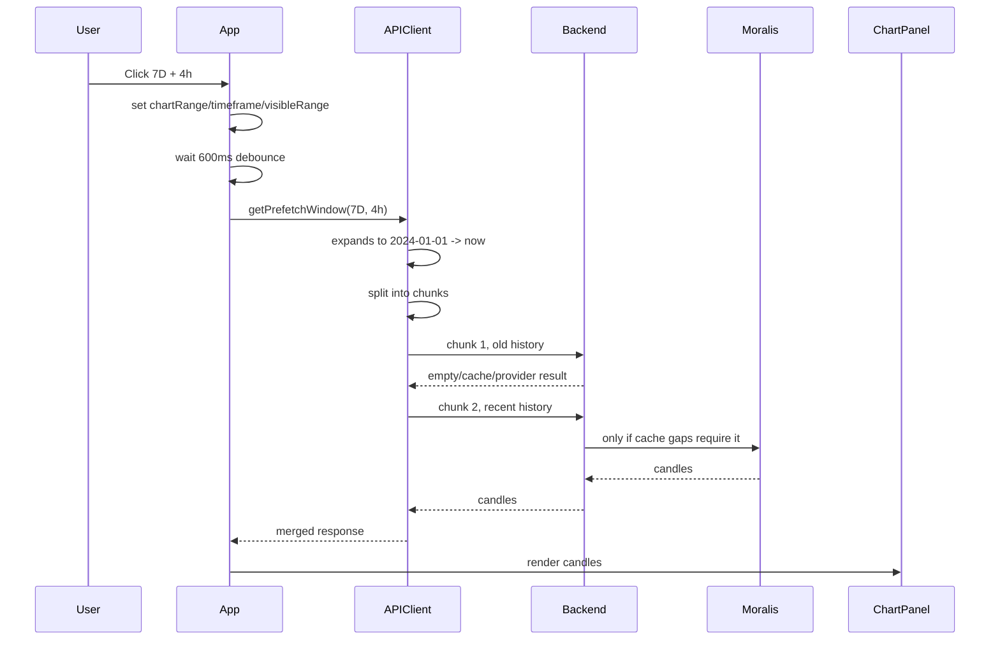

# 01 — Browser Flow: Click `7D` + `4h`

Target URL:

```txt
/solana/8WDxqnNj2WUDXS3oqXrQsRuiuCaAyuf9qTgmd43XDdDv?range=7D&timeframe=4h
```

Relevant files:

- `moralisCacheSystem/client/src/App.tsx`
- `moralisCacheSystem/client/src/api.ts`
- `moralisCacheSystem/client/src/ChartPanel.tsx`

## Step-by-step

### 1. URL/state initialization

`App.tsx` calls `getChartRouteFromLocation()` once at module load:

```ts
const INITIAL_CHART_ROUTE = getChartRouteFromLocation();
```

It extracts:

```txt
chain       = solana
pairAddress = 8WDx...DdDv
chartRange  = 7D
timeframe   = 4h
```

Then React state initializes:

```ts
const [timeframe, setTimeframe] = useState(INITIAL_CHART_ROUTE.timeframe);
const [chartRange, setChartRange] = useState(INITIAL_CHART_ROUTE.chartRange);
const [visibleRange, setVisibleRange] = useState(() => getRangeWindow(INITIAL_CHART_ROUTE.chartRange));
```

For `7D`, `visibleRange` is roughly:

```txt
from = now - 7 days
to   = now
```

### 2. Effective candle size calculation

`App.tsx` computes:

```ts
const effectiveTimeframe = getEffectiveTimeframeForWindow(timeframe, visibleRange);
```

For `7D + 4h`:

- requested timeframe = `4h`
- minimum for a 7 day window = `5min`
- effective timeframe remains `4h`

So the API is asked for `4h` candles.

### 3. Prefetch window calculation — major issue

`App.tsx` computes:

```ts
const loadRange = getPrefetchWindow(visibleRange, effectiveTimeframe);
```

In `client/src/api.ts`, `getPrefetchWindow()` does this:

```ts
const maxPrefetchMs = maxRequestCandlesByTimeframe[timeframe] * timeframeSeconds[timeframe] * 1000;
const visibleSpanMs = clampedVisibleTo - clampedVisibleFrom;
const allHistoryFrom = new Date('2024-01-01T00:00:00.000Z');
const oldestSafeFrom = clampedVisibleTo - maxPrefetchMs;
const prefetchFrom =
  visibleSpanMs > maxPrefetchMs
    ? oldestSafeFrom
    : new Date(Math.min(clampedVisibleFrom.getTime(), oldestSafeFrom.getTime()));
const from = new Date(Math.max(allHistoryFrom.getTime(), prefetchFrom.getTime()));
```

For `4h`:

```txt
maxRequestCandlesByTimeframe[4h] = 5000
5000 * 4h = 20,000 hours = ~833 days
```

Because `7D` is much smaller than `833 days`, this line chooses the earlier of:

```txt
visibleFrom       = now - 7 days
oldestSafeFrom    = now - ~833 days
```

That means it selects `oldestSafeFrom`, then clamps to `2024-01-01`.

So a visible 7 day chart can become a request from:

```txt
2024-01-01 -> now
```

This is the biggest client-side latency problem found so far.

### 4. Debounce before fetch

`App.tsx` waits:

```ts
const CHART_FETCH_DEBOUNCE_MS = 600;
```

So every chart state change has a built-in **600ms delay** before it even starts the API request.

This is useful for typing pair addresses, but feels slow for button clicks like range/timeframe selection.

### 5. Client request splitting

`fetchChartCandles()` in `client/src/api.ts` normalizes the window and splits it:

```ts
const chunks = getRequestChunks(effectiveParams);

for (const chunk of chunks) {
  responses.push(await fetchChartCandlesOnce({ ...effectiveParams, ...chunk }));
}
```

Important: chunks are fetched **sequentially**, not in parallel.

For `2024-01-01 -> now` at `4h`, the client may split into approximately:

```txt
chunk 1: 2024-01-01 -> around 2026-04
chunk 2: around 2026-04 -> now
```

For a brand new token created today, chunk 1 is guaranteed to be empty / useless, but we still wait for it before chunk 2 starts.

### 6. Chart render

`ChartPanel.tsx` receives `response.candles`.

If zero candles:

- old message: `No candles loaded yet`
- improved message now distinguishes loading vs actual 0-candle provider response.

## Timeline summary


